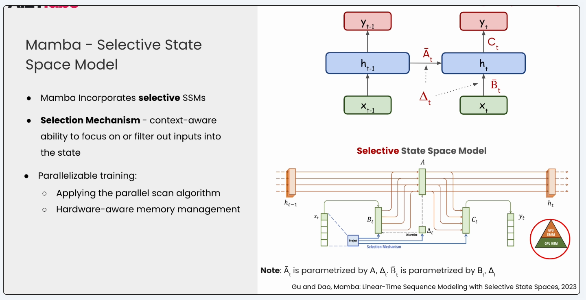
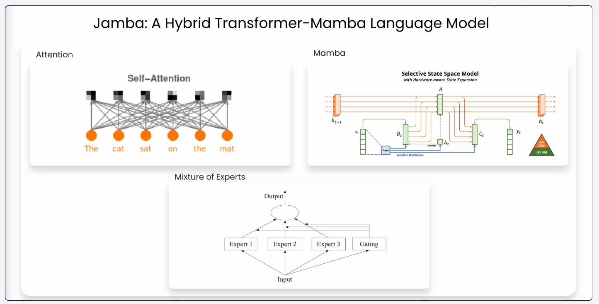
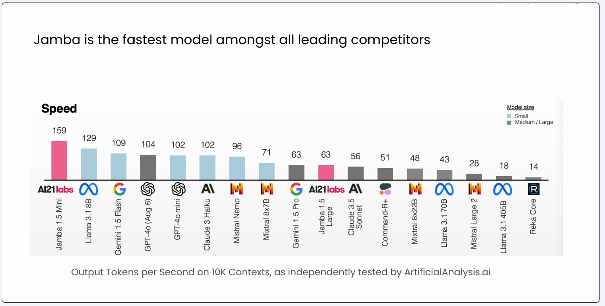

# Build long context AI Apps with Jamba

## Introduction

Transformers architecture, the fundamental building blocks of most of the Large Language Models, have hard time processing really long contexts in their prompts.

Alternatively, Mamba architecture can process really long context lengths by reading the context and compressing it into a fixed size representation. 

Mamba is a state space model (SSM) architecture that has garnered attention for its efficiency and performance characteristics. Here's a detailed breakdown:

Core Architecture Components:

1. Selective State Spaces (S4):

* Uses structured state space sequence models
* Handles long-range dependencies efficiently
* Employs a continuous-time representation

2. Hardware-Efficient Design:

* Linear time and memory complexity (O(n))
* Parallelizable computations
* Efficient hardware utilization on modern accelerators

Key Innovations:

a. Selective Scan Mechanism:

* Dynamically adjusts receptive field
* Uses data-dependent selective attention
* Allows model to focus on relevant parts of sequences

b. State Space Representation:

* Maintains a hidden state that evolves over time
* Updates state based on input sequences
* More memory-efficient than attention matrices

Advantages over Transformers:

1. Linear Scaling:

* Memory usage scales linearly with sequence length
* Computation time grows linearly
* More efficient for long sequences

2. Hardware Efficiency:

* Better utilization of modern hardware
* Reduced memory bandwidth requirements
* Faster inference times

Researchers found out that Mamba architecture as a stand alone architecture underperforms in handling long context sequences as the compression mechanism results in loss of information. So in comes JAMBA architecture. Jamba combines transformer's attention mechanism and Mamba's efficiency for better results in processing long context.

## Jamba Architecture

State - represents the internal memory that stores relevant past information that help to predict future outputs.

State based models use compression to store a fixed size state representation (same as RNN).

Structured State Space Models (s4) - imposes a specific structure on the model's parameters and process the states through linear operations.

### Inferencing 

A (bar), B (bar) and C are the model parameters used at every step to generate an output token. Given current token x{t} model combines linearly the previosu state h{t-1} and x{t} using A(bar) and B(bar)
to update the current state h{t}. 

A(bar) helps to decide what to forget and waht to remember from previous state and B(bar) helps to decide what to remember from current input.

After updating the current state model uses C to map the h{t} to output token meaning to decide what should be the output token.

A(bar) and B(bar) depends on Delta which helps to decide balance between previous and new information.

Limitations:

* While S4 models have higher training, inference and memory efficiency, the output efficiency still lags behind to that of a transformer.
This is because the state in S4 models are independent of the input.

Selective S4 models makes the model parameters dependent on input. This is called Mamba.

Limitations of Mamba:

* Falls short when careful handling of specific tokens is required. It falls short in predicting repeatative sequence of tokens.

Meaning:

transformer excels at predicting label (say either positive or negitive).
But Mamba, while predicts the correct intent it will predict non existing label (mamba says bad instead of Negative).

### Jamba architecture

In order to bring the best of both worlds while mtitigating the drawbacks, Jamba was introduced.

JAMBA stands for Joint attention and Mamba.

Apart from Attention and Mamba layers the architecture has a new layer called 'Mixture of Experts(MoE)'. This allows us to use only a portion of model weights on input token chosen as per the router.

According to the paper, balancing of attention layers and mamba layers is key. The paper suggests to have 1 layer of Attention layer and 7 Mamba layers to have high throughput and high efficient memory footprint.

