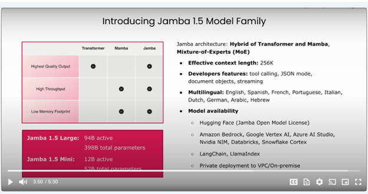
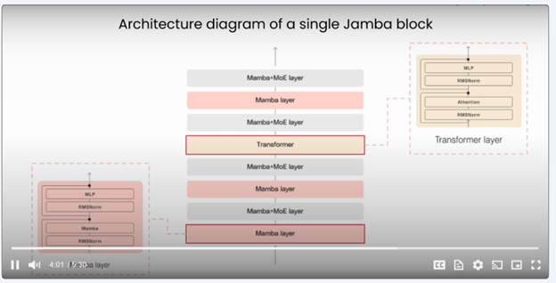
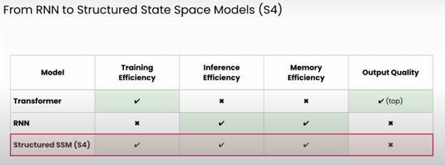

# Build long context AI Apps with Jamba

## Introduction

Transformers architecture, the fundamental building blocks of most of the Large Language Models, have hard time processing really long contexts in their prompts.

Alternatively, Mamba architecture can process really long context lengths by reading the context and compressing it into a fixed size representation. 

Mamba is a state space model (SSM) architecture that has garnered attention for its efficiency and performance characteristics. Here's a detailed breakdown:

Core Architecture Components:

1. Selective State Spaces (S4):

* Uses structured state space sequence models
* Handles long-range dependencies efficiently
* Employs a continuous-time representation

2. Hardware-Efficient Design:

* Linear time and memory complexity (O(n))
* Parallelizable computations
* Efficient hardware utilization on modern accelerators

Key Innovations:

a. Selective Scan Mechanism:

* Dynamically adjusts receptive field
* Uses data-dependent selective attention
* Allows model to focus on relevant parts of sequences

b. State Space Representation:

* Maintains a hidden state that evolves over time
* Updates state based on input sequences
* More memory-efficient than attention matrices

Advantages over Transformers:

1. Linear Scaling:

* Memory usage scales linearly with sequence length
* Computation time grows linearly
* More efficient for long sequences

2. Hardware Efficiency:

* Better utilization of modern hardware
* Reduced memory bandwidth requirements
* Faster inference times

Researchers found out that Mamba architecture as a stand alone architecture underperforms in handling long context sequences as the compression mechanism results in loss of information. So in comes JAMBA architecture. Jamba combines transformer's attention mechanism and Mamba's efficiency for better results in processing long context.

## Jamba Architecture

State - represents the internal memory that stores relevant past information that help to predict future outputs.

State based models use compression to store a fixed size state representation (same as RNN).

Structured State Space Models (s4) - imposes a specific structure on the model's parameters and process the states through linear operations.

